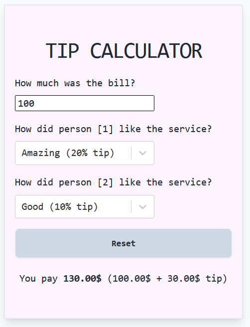

# Overview

This project has been created as part of the Ultimate React Course by Jonas Schmedtmann.

## Exercise

The purpose of this exercise was to create a tip calculator in order to cover the following React concepts:

- What state and props are
- The difference between state and props
- When to use state or props and why
- Sharing data & state via props
- Derived state
- Controlled elements
- When and how React renders state
- The child prop

## Images

